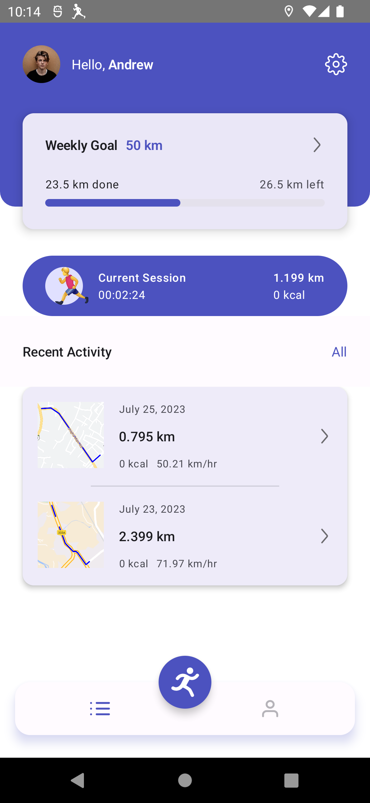
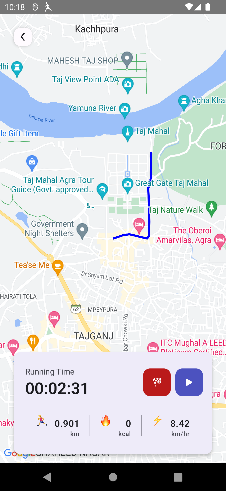
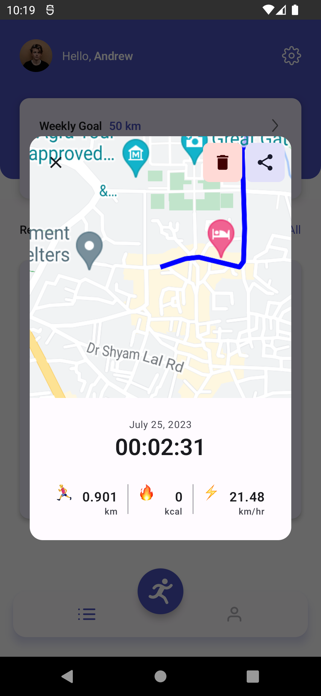
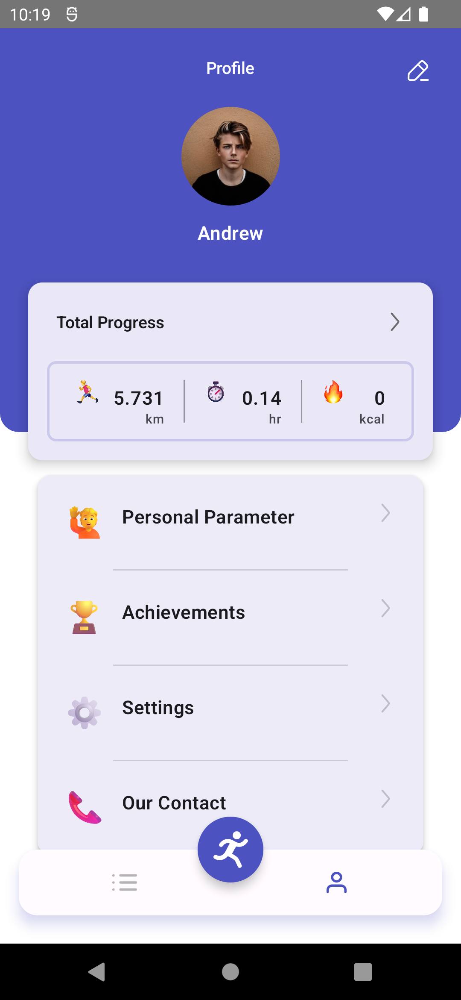
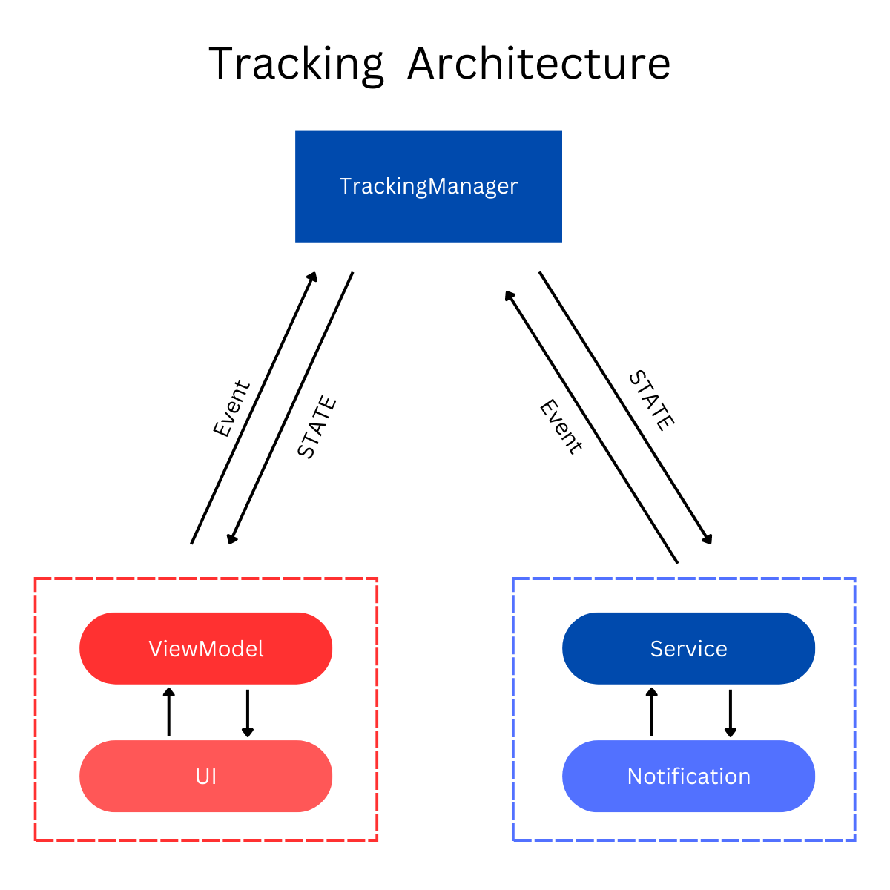

# RunTrack

RunTrack is a Fitness Tracking app utilizing modern Android technologies, including
Jetpack Compose, MVVM architecture, and Google Maps API. The app allows users to
track their running activities, displaying real-time routes on an interactive map
while storing essential statistics using Room database.

## Feature

1. Live tracking of running activity using GPS.
2. Tracking of user's running path in Google Map.
3. Using Foreground Service, even the user closed the app and remove
   from the background, this app stills continue to track user running stats.
4. Room database to store and manage running statistics.
5. Deep linking using jetpack navigation component.

## Screenshot

|                                         |                                          |
|-----------------------------------------|------------------------------------------|
|          |  |
|  |        |

## Folder Structure

- `core`: Handles the backend of the app like tracking and database related work.
- `ui`: Handles the user interface components.
- `utils`: Includes utility classes and helper functions used across the app.
- `di` : Contains hilt modules.

## Build With

[Kotlin](https://kotlinlang.org/) : As the programming language.  
[Jetpack Compose](https://developer.android.com/jetpack/compose) : To build UI.  
[Jetpack Navigation](https://developer.android.com/jetpack/compose/navigation) : For navigation
between screens and deep linking.
[Room](https://developer.android.com/jetpack/androidx/releases/room) : To store and manage running
statistics.  
[Google Maps API](https://developers.google.com/maps/documentation/android-sdk) : To track user's
running activity such as speed, distance and path on
the map.  
[Hilt](https://developer.android.com/training/dependency-injection/hilt-android) : For injecting
dependencies.

## Architecture

This app follows MVVM architecture, Uni Directional Flow (UDF) pattern and Single architecture
pattern.
HLD of tracking architecture is shown in the below image:

## Project Status

This app is still in development. These features are left to be
implemented:

1. User running statistics on a chart.
2. Storing user info such as weight, height etc using
   Jetpack DataStore library.
3. Use weight to determine calories burnt while running.
